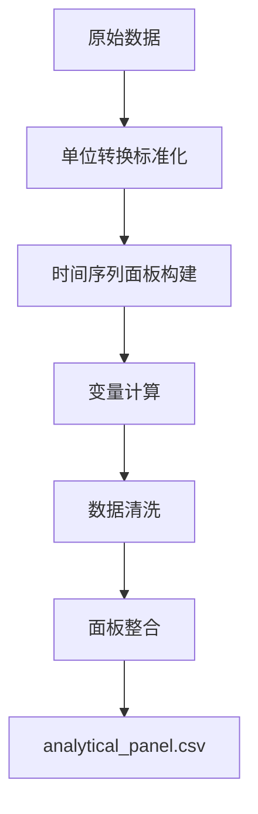

# 08_variable_construction - 变量构建模块 v3.0

## 📖 模块概述

本模块根据`research_outline.md`研究大纲，构建研究所需的4个核心变量，生成干净、可靠的分析面板数据。

**核心目标**: 从原始数据出发，构建支持模块09计量分析的标准化国别-年度面板数据集。

## 🎯 核心变量

根据研究大纲，本模块构建以下4个核心变量：

### 1. **Node-DLI_US** (美国锚定动态锁定指数)
- **定义**: $NodeDLI^{US}_{i,t} = s^{imp}_{i,US,t} \cdot DLI_{US\to i,t} + (1-s^{imp}_{i,US,t}) \cdot DLI_{i\to US,t}$
- **数据源**: 04_dli_analysis模块的边级DLI + 01模块贸易份额
- **作用**: 量化各国与美国贸易关系的"质量"而非仅仅"数量"

### 2. **Vul_US** (美国锚定脆弱性指数) 
- **定义**: $Vul^{US}_{i,t} = s^{imp}_{i,US,t} \cdot HHI^{orig}_{i,t}$
- **数据源**: 01模块贸易流数据
- **作用**: 量化各国对"美国断供"风险的暴露程度

### 3. **OVI** (天然气物理冗余指数)
- **定义**: OVI = (LNG接收站容量 + 天然气管道容量) / 天然气消费量
- **数据源**: GEM数据库LNG终端 + 管道 + EI统计消费数据
- **作用**: 量化各国能源进口的物理选择权

### 4. **US_ProdShock** (美国产量冲击)
- **定义**: HP滤波后的美国油气产量周期成分
- **数据源**: EIA API
- **作用**: 作为外生冲击的工具变量

## 🏗️ 架构设计

### 核心文件

```
08_variable_construction/
├── clean_main.py              # 主构建器 - 整合所有变量
├── simple_gas_ovi_builder.py  # 天然气OVI专用构建器
├── universal_unit_converter.py # 通用单位转换器
├── config.py                  # 配置文件
├── 08data/                    # 中间数据存储
│   ├── rawdata/              # 原始Excel文件
│   ├── gas_ovi_clean.csv     # 清洁天然气OVI数据
│   ├── node_dli_us_clean.csv # Node-DLI_US数据
│   ├── vul_us_clean.csv      # Vul_US数据
│   └── us_prod_shock_clean.csv # US冲击数据
└── outputs/
    └── analytical_panel.csv  # 最终分析面板
```

### 设计原则

1. **回归初心**: 严格按照research_outline.md要求，不添加额外变量
2. **单一职责**: 每个模块只负责一类变量的构建
3. **数据一致性**: 确保中间文件与最终面板数据完全一致
4. **可追溯性**: 每个变量都能追溯到原始数据源

## 🚀 使用方法

### 基础运行
```bash
python3 clean_main.py
```

### 单独构建天然气OVI
```bash
python3 simple_gas_ovi_builder.py
```

## 📊 输出数据质量

### 最终面板 (analytical_panel.csv)
- **数据规模**: 450行 × 17列
- **国家覆盖**: 18个主要经济体
- **时间跨度**: 2000-2024年

### 核心变量覆盖率
- **Node-DLI_US**: 58.0% (261/450)
- **Vul_US**: 58.0% (261/450) 
- **OVI_gas**: 50.9% (229/450)
- **US_ProdShock**: 92.0% (414/450)

### 数据质量保证
- ✅ 数值范围合理，无异常值
- ✅ 中间文件与最终面板数据一致
- ✅ 时间序列连续性良好
- ✅ 单位转换准确

## 🔄 数据流程



## 📈 性能优化

- **运行时间**: 约26秒 (完整流水线)
- **内存使用**: 优化Excel读取，减少内存占用
- **API调用**: 智能缓存，避免重复请求

## 🛠️ 技术特性

### 单位转换系统
- 支持36种能源单位自动转换
- LNG: mtpa → BCM/年
- 管道: 多种流量单位 → BCM/年
- 石油: 各种产量单位 → MTPA

### 数据质量控制
- 异常值检测和清理
- 缺失值合理处理
- 时间序列一致性检查

### 错误处理
- 文件缺失自动跳过
- API超时重试机制
- 单位转换失败容错

## 📝 版本历史

### v3.0 - 回归初心版 (当前)
- 🎯 严格按照research_outline.md构建
- ❌ 移除所有石油OVI相关内容
- ✅ 简化架构，提升可靠性
- 📊 确保数据一致性

### v2.0 - 性能优化版 (已归档)
- ⚡ 大幅性能提升 (5分钟→42秒)
- 🔧 优化Excel读取和内存使用
- ❌ 存在数据一致性问题

### v1.0 - 初始版本 (已归档)  
- 🏗️ 建立基础架构
- 📊 实现多能源OVI计算
- ⚠️ 存在重复数据和性能问题

## 🔗 模块依赖

### 输入依赖
- **01_data_processing**: 贸易流数据
- **03_metrics**: 网络中心性指标  
- **04_dli_analysis**: DLI面板数据

### 输出支持
- **09_econometric_analysis**: analytical_panel.csv

## 💡 使用建议

1. **运行环境**: 确保网络连接正常 (EIA API调用)
2. **数据更新**: 原始Excel文件更新时重新运行
3. **质量检查**: 运行后检查日志文件确认数据质量
4. **版本控制**: 重要分析前备份outputs目录

---

*本模块为美国能源独立国际影响研究项目的核心数据基础*  
*Energy Network Analysis Team - 2024*